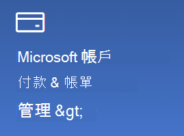

# 變更我的 Microsoft 帳戶資訊

如有需要，請移至 [https://account.microsoft.com](https://account.microsoft.com/) 並登入。 這麼做將帶您前往您的帳戶儀表板。  

**編輯我的名稱和個人資訊**

1. 在您的帳戶儀表板上，按一下您的帳戶圖片和名稱旁邊的三個點 (更多動作) > [編輯設定檔]**。
2. 在 [編輯設定檔 **]** 頁面上，使用提供的連結來變更您的設定檔圖片、名稱、生日、位置和顯示語言喜好設定。 請記下您的 Xbox 或 Skype 帳戶設定檔的連結，在其中，您可以變更這些帳戶特定的詳細資料。

**管理電子郵件地址和電話號碼**

一個 Microsoft 帳戶會有與其相關聯的一或多個電子郵件地址或電話號碼做為「別名」。若要管理這些項目：

1. 在您的帳戶儀表板上，按一下您的帳戶圖片和名稱旁邊的三個點 (更多動作) > [編輯設定檔 **]**。
2. 在 [編輯設定檔 **]** 頁面上，按一下 [管理您登入 Microsoft 的方式 **]**。 
3. 您會看到帳戶別名的清單，而您可以管理該清單，包括新增和刪除電子郵件地址和電話號碼。 您也可以在這裡選取可用來登入該帳戶的別名，以及將哪個別名視為「主要」，而它會顯示在您的 Windows 10 裝置上。

**管理付款方式，以及用於帳單的姓名和地址** 

1. 在您的帳戶儀表板上，按一下您的帳戶圖片和名稱旁邊的三個點 (更多動作) > [編輯設定檔 **]**。
2. 在 [付款與帳單 **]** 下，按一下 [管理 **]**。

    

3. 您可以在這裡新增、編輯和移除付款方式及相關聯的帳單地址。 
