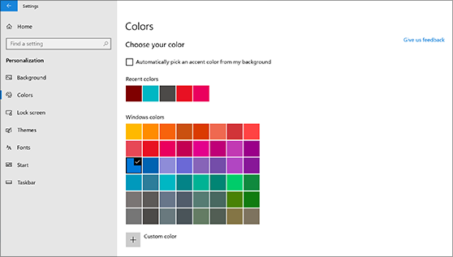
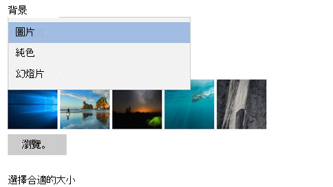

# 變更您的桌面背景和色彩

若要變更您的色彩設定，請移至 [**開始**  >  **設定** 的  >  **個人** 化  >  **色彩**]，然後選擇您自己的色彩，或從您的背景 Windows 提取強調文字色彩。

若要變更您的桌面背景，請移至 [**開始**  >  **設定**  >  **個人** 化  >  **背景**]，然後選擇圖片、純色或建立圖片的幻燈效果。 

需要更多桌面背景和色彩？ 流覽[Microsoft Store](https://www.microsoft.com/store/collections/windowsthemes)以從數十個自由主題中選擇。
