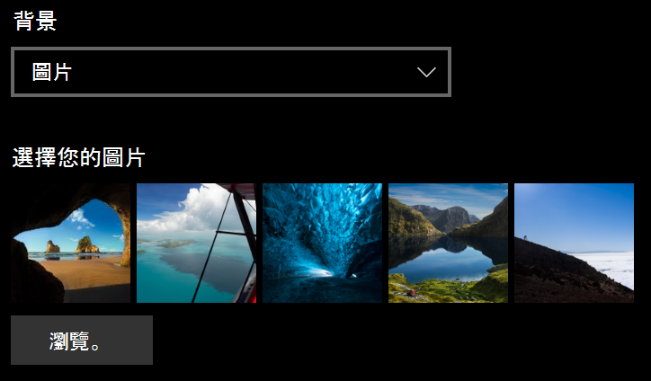
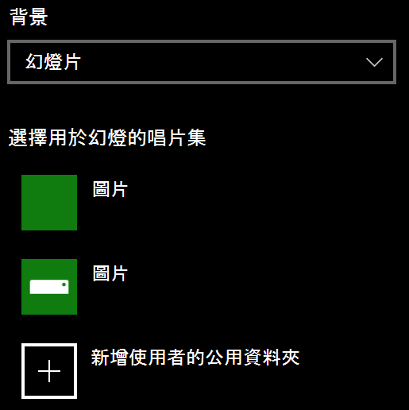

# 變更您的鎖定畫面背景

- 移至 [**設定**  >  **個人**化  >  **鎖定] 畫面**。 或者按一下或點擊 [這裡](ms-settings:lockscreen?activationSource=GetHelp)。

- 若要設定自訂背景圖片，請從 [**背景**] 下拉式清單中選取 [**圖片**]，然後選擇或**流覽**至圖片。

  

- 若要設定自訂圖片的幻燈播放清單，請從 [**背景**] 下拉式清單中選取 [**投影片放映**]，然後選擇曲集或新增包含幻燈的圖片的資料夾。

  
