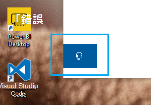

# 按一下耳機按鈕以與我們聯繫Contact us by clicking the headphone button

如果您想要聯繫 Microsoft 支援人員，請按一下此 app 左下角的 **[聯繫我們]** 。If you'd like to contact Microsoft Support, please click **Contact us** in the lower left corner of this app. 在 [飛出] 視窗內，在選擇您的產品及問題類別之後，您將會向正確的支援管道導向。Inside the fly-out window, you will be guided to the right support channel after choosing your product and issue category.

您可以繼續與其他應用程式互動，即使您已開始聯繫我們會話。You can keep interacting with the rest of the app even after you have initiated a Contact us session. 按一下 app 內的任何其他地方，即可暫時將 [與我們聯繫] 面板降到最低。The Contact us panel can be temporarily minimized by clicking anywhere else inside the app. 若要回到同一個會話，**只要按一下 [與我們聯繫]** 。To return to the same session, just click **Contact us** again.
