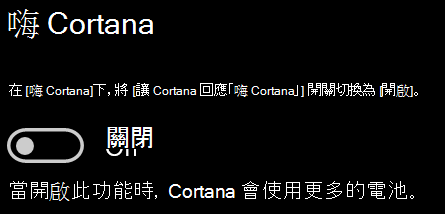

# Cortana 沒有與我講話，或聽不到我Cortana doesn’t talk to me or can’t hear me

如果您嘗試使用「嗨 Cortana」功能，請確認已啟用此功能 (該功能可讓您不選取工作列上的 [Cortana] 按鈕，或 [Cortana] 面板中的 [麥克風] 按鈕，就能與 Cortana 講話)：If you are trying to use the "Hey Cortana" feature, which allows you to talk to Cortana without selecting the Cortana button on the taskbar or the microphone button in the Cortana panel, confirm that the feature is enabled:

1. 移至 **[開始]**，然後選取 **[[設定] > [Cortana]](ms-settings:cortana?activationSource=GetHelp)**。Go to **Start**, then select **[Settings > Cortana](ms-settings:cortana?activationSource=GetHelp)**.
2. 在 **[嗨 Cortana]** 下，將 **[讓 Cortana 回應「嗨 Cortana」]** 開關切換為 **[開啟]**。Under **Hey Cortana**, switch the **Let Cortana respond to "Hey Cortana"** toggle to **On**.

**您的隱私權設定是否阻止 Cortana 聽到您?****Are your privacy settings preventing Cortana from hearing you?**

您的隱私權設定可能阻止 Cortana 回應的語音。Your privacy settings can prevent Cortana from responding to your voice.
- 檢查確認已開啟 [線上語音辨識]：Check to make sure Online Speech recognition is turned on:
    - 移至 **[開始]**，然後按一下 **[[設定] > [隱私權] > [語音]](ms-settings:privacy-speech?activationSource=GetHelp)**。Go to **Start**, then click **[Settings > Privacy > Speech](ms-settings:privacy-speech?activationSource=GetHelp)**.
    - 在 **[線上語音辨識]** 下，將設定切換為 **[開啟]**。Under **Online speech recognition**, switch the setting to **On**.
- 請檢查確認 Cortana 擁有存取您麥克風的權限。Check to make sure Cortana has permission to access your microphone. 
    - 移至 [開始]，然後按一下 **[[設定] > [隱私權] > [麥克風]](ms-settings:privacy-microphone?activationSource=GetHelp)**。Go to Start, then click **[Settings > Privacy > Microphone](ms-settings:privacy-microphone?activationSource=GetHelp)**.
    - 在 **[選擇可以存取您麥克風的 App]** 下，在應用程式和服務清單中尋找 **[Cortana]**，並確認已將開關切換為 **[開啟]**。Under **Choose which apps can access your microphone**, look for **Cortana** within the list of apps and services and make sure the switch is toggled to **On**.

此外，也請確認您的喇叭或麥克風運作正常，以便與 Cortana 講話。Moreover, please also make sure that your speakers or microphones are up and working in order to talk to Cortana.
