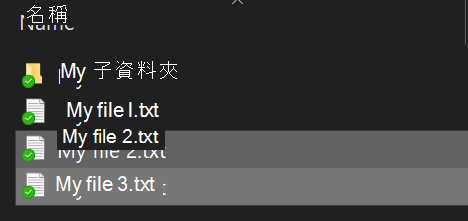

# 在 Windows 10 中加密檔案或資料夾

您可以使用 BitLocker 加密整個磁碟，但只加密個別檔案或資料夾 (及其內容)：

1. 在**檔案總管**中，選取您要加密的檔案/資料夾。 在此範例中，已選取兩個檔案：

    

2. 以滑鼠右鍵按一下已選取的檔案，然後按一下 **[屬性]**。

3. 在 **[屬性]** 視窗中，按一下 **[進階]**。

4. 在 **[進階屬性]** 視窗中，選取 **[加密內容以保護資料]** 核取方塊：

    

5. 按一下 [確定]****。
