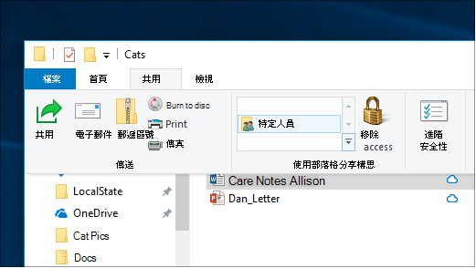
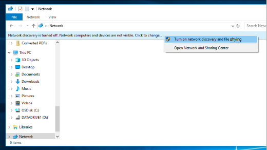

# 在 Windows 10 中透過網路共用檔案File sharing over a network in Windows 10

**附注**：如果您先前已使用家庭組進行檔案共用，請注意已從 Windows 10 (版本 1803) 中移除家庭組。**Note**: If you previously used HomeGroup for file sharing, please note that HomeGroup has been removed from Windows 10 (Version 1803). 您現在可以使用 Windows 10 中的內建功能來共用印表機和檔案。You can now share printers and files by using built-in features in Windows 10.

**透過網路共用檔案或資料夾****To share files or folders over a network**

- 在檔案 **資源管理器** 中，選取檔案 > 按一下 [**共用物件**] 區段中頂端 > 的 [**共用**] 索引標籤，按一下 [**特定人員**]。In **File Explorer**, select a file > click the **Share** tab at the top > in the **Share with** section, click **Specific people**.

    
          
- 如果您同時選取多個檔案，可以以相同的方式共用這些檔案。If you select multiple files at once, you can share them all in the same way. 它也適用于資料夾。It works for folders, too.

**若要查看網路上共用檔的裝置****To see devices on the network that are sharing files**

- 在檔案 **瀏覽器** 中，移至 [ **網路**]。In **File Explorer**, go to **Network**. 如果未啟用網路探索，您會看到錯誤訊息「網路探索已經關閉 ...」。If Network discovery is not enabled, you will see an error message "Network discovery is turned off..."

- 按一下 [ **網路探索] 已關閉** 橫幅，然後按一下 [ **開啟網路探索與檔案共用**]。Click the **Network discovery is turned off** banner, then click **Turn on network discovery and file sharing**.

    

[深入瞭解透過網路檔案共用Read more about file sharing over a network](https://support.microsoft.com/help/4092694/windows-10-file-sharing-over-a-network)

[使用應用程式、OneDrive、電子郵件等共用檔案Share files using apps, OneDrive, emails, and more](https://support.microsoft.com/help/4027674/windows-10-share-files-in-file-explorer)
