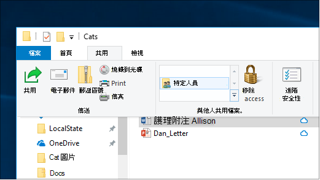

# 在 Windows 10 中透過網路共用檔案

**附注**：如果您先前使用家庭組進行檔案共用，請注意已從 Windows 10 (版本 1803) 中移除家庭組。 您現在可以使用 Windows 10 中內建的功能來共用印表機和檔案。

**透過網路共用檔案或資料夾**

- 在檔案 **資源管理器** 中，選取檔案 > 按一下 [**共用物件**] 區段中頂端 > 的 [**共用**] 索引標籤，按一下 [**特定人員**]。

    
          
- 如果您同時選取多個檔案，可以以相同的方式共用這些檔案。 它也適用于資料夾。

**若要查看網路上共用檔的裝置**

- 在檔案 **瀏覽器** 中，移至 [ **網路**]。 如果未啟用網路探索，您會看到錯誤訊息「網路探索已經關閉 ...」。

- 按一下 [ **網路探索] 已關閉** 橫幅，然後按一下 [ **開啟網路探索與檔案共用**]。

    

[深入瞭解透過網路檔案共用](https://support.microsoft.com/help/4092694/windows-10-file-sharing-over-a-network)

[使用應用程式、OneDrive、電子郵件等共用檔案](https://support.microsoft.com/help/4027674/windows-10-share-files-in-file-explorer)
