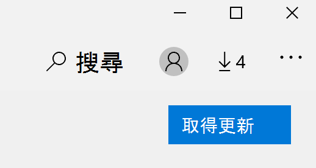

# 修正應用程式的顯示語言Fix the display language of apps

在 Windows 10 中變更顯示語言之後，當您開啟某些應用程式時，可能仍會使用先前的語言。After you change the display language in Windows 10, some apps may still use the previous language when you open them. 發生這種情況是因為必須從存放區下載該語言的應用程式的新版本。This happens because new versions of the apps for that language must be downloaded from the Store. 若要修正此問題，您可以等候自動更新，也可以手動安裝更新版本的應用程式。To fix this problem, you can either wait for the automatic update, or you can manually install the updated version of the apps.

若要手動安裝更新，請開啟 [ **Microsoft Store** ]，然後按一下右上角的 [ **下載和更新** ]。To manually install the update, open **Microsoft Store** and click **Downloads and updates** in the top right corner. 然後按一下 [ **取得更新**]。Then click **Get updates**. 若在更新完成之後未變更語言，請嘗試重新開機您的電腦。If the language is not changed after the update is complete, try restarting your PC.

若要深入瞭解輸入和顯示語言設定，請參閱 [管理您的輸入和顯示 Windows 10 中的語言設定](https://support.microsoft.com/help/4027670/windows-10-add-and-switch-input-and-display-language-preferences)。To read more about input and display language settings, see [Manage your input and display language settings in Windows 10](https://support.microsoft.com/help/4027670/windows-10-add-and-switch-input-and-display-language-preferences).
