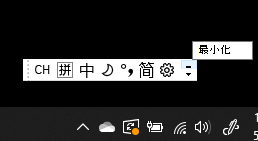

# 隱藏、顯示或重設語言列Hide, display, or reset the language bar

**若要最小化語言列：****To minimize the language bar:**

您可以按一下語言列右上角的 [最小化] 按鈕。You can click the minimize button on the top right corner of the language bar. 或者，您可以將語言列拖曳到工作列，這樣就能自動將它最小化。Or, you can just drag the language bar to the task bar, which will automatically minimize it.

**若要彈出語言列：****To pop out the language bar:**

如果您不想在工作列中固定語言列，請以滑鼠右鍵按一下工作列中的任何空白區域，然後取消選取 [工具列] 功能表中的 **[語言列]** 選項。If you don't want to dock the language bar in the taskbar, right-click any empty space in the taskbar, and uncheck the **Language bar** option in the Toolbars menu. 這會讓語言列在工作列外部顯示，就像之前的螢幕擷取畫面一樣。This will make the language bar appear outside the taskbar, just like the previous screenshot.

**若要將語言列還原為預設值：****To restore the language bar to default:**

以滑鼠右鍵按一下工具列中的 [語言] 按鈕，然後按一下功能表中的 **[還原語言列]** 選項。Right-click the language button in the toolbar, and click **Restore the language bar** option in the menu. 這會將其還原為預設值。This will restore it to default.

