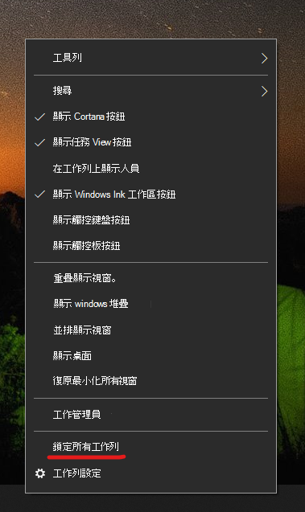

# 將工作列動移至桌面的一邊或頂端

首先，請確認工作列已解鎖。 若要找出您的工作列是否已解鎖，請以滑鼠右鍵按一下工作列上的任何空白區域，並查看 **[鎖定工作列]** 旁是否有核取記號。 如果有核取記號，表示工作列已鎖定且無法移動。 按一下 **[鎖定工作列]** 一次，即可將其解除鎖定，並移除核取記號。

如果您有多個螢幕顯示工作列，您會看到 **[鎖定所有工作列]**。

解除鎖定工作列之後，您可以長按工作列上的任何空白區域，並將其拖曳到您想要的螢幕上。 您也可以用滑鼠右鍵按一下工作列上的任何空白區域，並移至 **[[工作列設定]](ms-settings:taskbar?activationSource=GetHelp) > [螢幕上的工作列位置]**。
