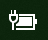

# Windows 10 中的 [電源] 或 [電池] 圖示遺失Power or battery icon missing in Windows 10

如果您的 Windows 10 裝置有電池 (例如，膝上型電腦或平板電腦，或透過 USB 連線到 UPS 的 PC)，通常會在工作列中的時鐘旁顯示電源/電池圖示，例如：If your Windows 10 device has a battery (e.g., laptop or tablet, or a PC connected via USB to a UPS), normally a power/battery icon is shown in the taskbar near the clock, for example:

如果您沒有看到此圖示，則它可能為隱藏狀態：If you don't see this icon, it may be hidden:

1. 移至 **[[設定] > [個人化] > [工作列]](ms-settings:taskbar?activationSource=GetHelp)**。Go to **[Settings > Personalization > Taskbar](ms-settings:taskbar?activationSource=GetHelp)**.

2. 在 [通知區域] 中，按一下 **[選取要顯示在工作列上的圖示]**。In the Notification area, click **Select which icons appear on the taskbar**.

3. 然後在清單中找到 **[電源]** 項目，並將其設定切換為 **[開啟]**。Then find the **Power** item in the list and toggle its setting to **On**.

    

**疑難排解****Troubleshooting**

如果您已依照上述指示，且 **[電源]** 切換開關呈現灰色或不可見，請在工作列上的 [搜尋] 方塊中輸入**裝置管理員**，然後選取結果清單中的 **[裝置管理員]**。If you followed the above instructions and the **Power** toggle is greyed out or not visible, in the search box on the taskbar, type **device manager**, and then select **Device Manager** in the list of results. 在 **[電池]** 底下，以滑鼠右鍵按一下您裝置的電池，按一下 **[停用]**，然後按一下 **[是]**。Under **Batteries**, right-click the battery for your device, click **Disable**, and click **Yes**. 請稍候幾秒，然後以滑鼠右鍵按一下電池，然後按一下 **[啟用]**。Wait a few seconds, and then right-click the battery and click **Enable**. 然後重新啟動您的裝置。Then restart your device.

如果您依照上述指示操作，但電池圖示並未出現在工作列上，請在工作列上的 [搜尋] 方塊中輸入**工作管理員**，然後在結果清單中按一下 **[工作管理員]**。If you followed the above instructions, but the battery icon does not appear on the taskbar, in the search box on the taskbar, type **task manager**, and then click **Task Manager** in the list of results. 在 **[處理程序]** 索引標籤的 **[名稱]** 底下，以滑鼠右鍵按一下 **[檔案總管]**，然後按一下 **[重新啟動]**。On the **Processes** tab, under **Name**, right-click **Explorer**, and then click **Restart**.
