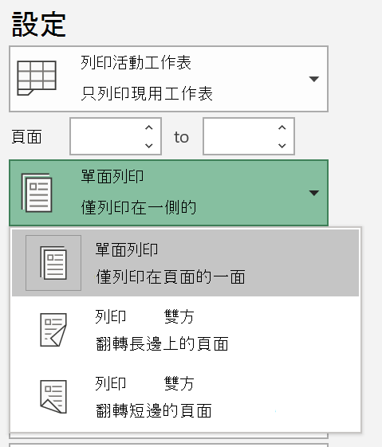

# 紙張雙面列印 (雙面列印)Printing on both sides of paper (duplex printing)

**我的印表機是否能夠雙面列印？****Is my printer capable of duplex printing?**

您的印表機功能摘要或手動應會告訴您其是否可以進行紙張雙面列印，也稱為「雙面列印」。Your printer’s feature summary or manual should tell you whether it is capable of printing on both sides of the paper, also known as “duplex printing.” 如果您有 Microsoft Office，另一種方法是開啟 Word 或 Excel 等 Office 應用程式，移至 **[檔案] > [列印]**，確認已選取正確印表機，並尋找 [設定] 區段中的功能。If you have Microsoft Office, another way to find out is by opening an Office app like Word or Excel, going to **File > Print**, making sure the right printer is selected, and looking for the capability in the Settings section. 例如：For example: 

**Microsoft Office 中的雙面列印****Duplex printing in Microsoft Office**

如果您的印表機能夠雙面列印，移至 Office 應用程式中 **[檔案] > [列印]** 時，會看到「雙面列印」的選項，如上述範例所示。If your printer is capable of printing on both sides, when you go to **File > Print** in the Office app, you will see an option to “Print on Both Sides,” as shown in the example above.  選取您想要的雙面列印類型 ([在長邊緣翻轉] 或 [在短邊緣翻轉])，然後按一下 **[列印]** 以開始列印成品。Select the type of duplex printing you want (flip on long edge, or flip on short edge), and click **Print** to start the printout.

**從任何應用程式進行雙面列印****Duplex printing from any application**

您在進行列印的許多應用程式中，會看到向這樣的一般列印對話方塊：In many apps when you print you will see a general print dialog that looks like this: 

![[列印] 對話方塊](media/print-dialog.png)

確認已選取正確的印表機，然後按一下 **[喜好設定]** 以開啟 [印表機喜好設定] 視窗。Make sure the right printer is selected, then click **Preferences** to open the printer preferences window. 如果印表機支援雙面列印，該視窗中將會顯示為目前列印工作啟用此功能的能力。If the printer is capable of duplex printing, the ability to enable this for the current print job will show in that window.
