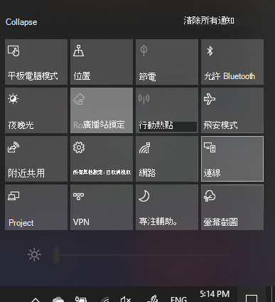

# 投影至電腦Project to a PC

在目的地裝置上 (投影目標)，搜尋 [投影設定]，以開啟 **[投影到此電腦]** 的 [設定] 頁面。On your destination device (projecting to), search for "Projection Settings" to open the Settings page of **Projecting to this PC**. 然後確定下列狀況：Then make sure that:
- 「當您說出 [確定] 時，某些 Windows 和 Android 裝置可以投影到這台電腦」下拉式功能表設定為 **[永遠關閉]**。"Some Windows and Android devices can project to this PC when you say it's OK" drop-down menu is set to **Always Off**.
- 「要求投影到此電腦」下拉式功能表設定為 **[每次要求連線時]**。"Ask to project to this PC" drop-down menu is set to **Every time a connection is required**.
- 「需要 PIN 碼以進行配對」下拉式功能表設定為 **[永不]**。"Require PIN for pairing" drop-down menu is set to **Never**.

在目的地裝置上，請移至 **[開始]** 並搜尋「連線」，啟動**連線**應用程式。On your destination device, launch **Connect** app by going to **Start** and search for "Connect".

然後，在您要用來投影的來源裝置上：Then, on your source device that you are trying to project from:

1. 按 **Windows 鍵+A**，以開啟 [控制中心]。Press **Windows key + A** to open Action Center.
2. 按一下 **[連線]**。Click **Connect**.
3. 按一下您要用來投影畫面的裝置。Click the device you want to project the screen to.

在上述步驟之後，目的地裝置應顯示來源裝置的畫面，就如同它是輔助監視器一樣。After the above steps, your destination device should display the screen of the source device as if it is a secondary monitor.
