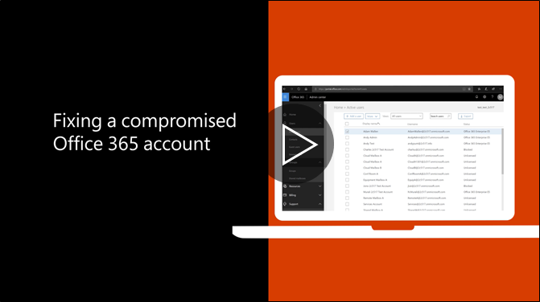

# 如果危害帳戶所採取建議的步驟Recommended steps to take if an account is compromised

  
1. [重設使用者密碼](https://support.office.com/article/7a5d073b-7fae-4aa5-8f96-9ecd041aba9c)立即。不與使用者通訊透過電子郵件的新密碼。[Reset the user's password](https://support.office.com/article/7a5d073b-7fae-4aa5-8f96-9ecd041aba9c) immediately. Do not communicate the new password through email to the end user. 
    
2. 移除任何可疑[轉寄地址](https://support.office.com/article/ab5eb117-0f22-4fa7-a662-3a6bdb0add74)設定信箱層級。Remove any suspicious [forwarding addresses](https://support.office.com/article/ab5eb117-0f22-4fa7-a662-3a6bdb0add74) set at the mailbox level. 
    
3. 移除設定信箱內的任何可疑[收件匣規則](https://support.office.com/article/1433E3A0-7FB0-4999-B536-50E05CB67FED)。Remove any suspicious [inbox rules](https://support.office.com/article/1433E3A0-7FB0-4999-B536-50E05CB67FED) set within the mailbox. 
    
4. 如果使用者已封鎖傳送電子郵件，[請移至要解除封鎖帳戶限制的使用者](https://protection.office.com/?hash=/restrictedusers)。一旦完成，則使用者應無法繼續傳送郵件的 1 小時內。If the user is blocked from sending email, [go to the Restricted Users to unblock the account](https://protection.office.com/?hash=/restrictedusers). Once done, the user should be able to resume sending messages within 1 hour.
    
5. 除非您有自信帳戶不再危害移除任何[系統管理角色群組](https://support.office.com/article/eac4d046-1afd-4f1a-85fc-8219c79e1504)的使用者帳戶。Remove the user account from any [administrative role groups](https://support.office.com/article/eac4d046-1afd-4f1a-85fc-8219c79e1504) until you are confident that the account is no longer compromised. 
    
最小化未來可能會有資料漏洞或洩漏的帳戶，建議您閱讀本公司的[Office 365 安全性最佳作法文章](https://support.office.com/article/9295e396-e53d-49b9-ae9b-0b5828cdedc3)。To minimize the potential of a data breach or a compromised account in the future, we recommend reading our [Office 365 Security best practices article](https://support.office.com/article/9295e396-e53d-49b9-ae9b-0b5828cdedc3).
  

