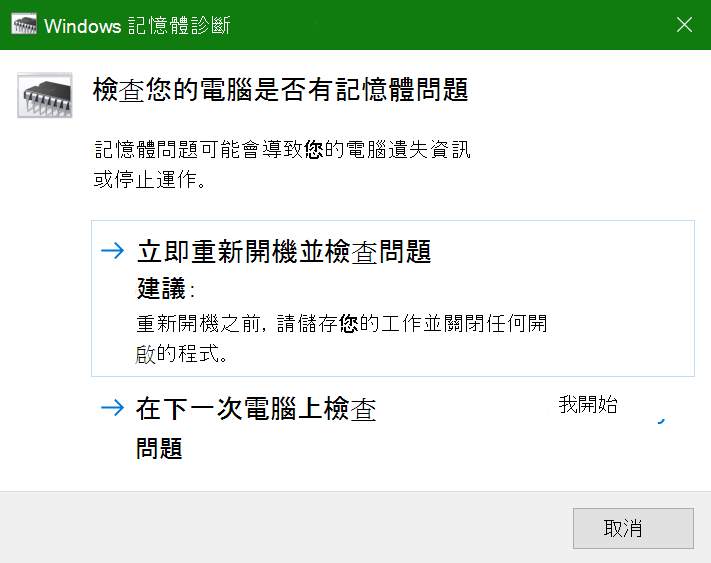
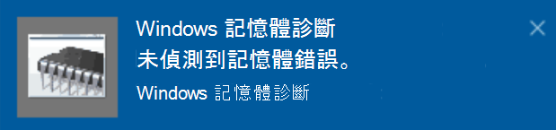

# 在 Windows 10 中執行 Windows 記憶體診斷Run Windows Memory Diagnostics in Windows 10

如果您電腦上的 Windows 和應用程式當機、凍結，或運作不穩定，則您的電腦記憶體 (RAM) 可能有問題。If Windows and apps on your PC are crashing, freezing, or acting in an unstable manner, you may have a problem with the PC’s memory (RAM). 您可以執行「Windows 記憶體診斷」來檢查電腦 RAM 的問題。You can run the Windows Memory Diagnostic to check for problems with the PC’s RAM.

在工作列上的搜尋方塊中，輸入**記憶體診斷**，然後選取 [Windows 記憶體診斷]\*\*\*\*。In the search box on your taskbar, type **memory diagnostic**, and then select **Windows Memory Diagnostic**. 

若要執行診斷，需要將電腦重新開機。To run the diagnostic, the PC needs to restart. 您可以選擇立即重新開機 (請先儲存您的工作，然後關閉開啟的文件和電子郵件)，或將診斷程式安排在下次電腦重新開機時自動執行：You have the option to restart immediately (please save your work and close open documents and e-mails first), or schedule the diagnostic to run automatically the next time the PC restarts:

當電腦重新開機時，**Windows 記憶體診斷工具**將會自動執行。When the PC restarts, the **Windows Memory Diagnostics Tool** will run automatically. 診斷程式執行時會顯示狀態和進度，而且您可以選擇按下鍵盤上的 **ESC** 鍵來取消診斷程式。Status and progress will be displayed as the diagnostics run, and you have the option of cancelling the diagnostics by hitting the **ESC** key on your keyboard.

當診斷程式完成時，Windows 會正常啟動。When the diagnostics are complete, Windows will start normally.
緊接在電腦重新開機之後，桌面出現時，系統會顯示通知 (在工作列上的 [重要訊息中心]\*\*\*\* 圖示旁)，以指出是否發現任何記憶體錯誤。Immediately after restart, when the Desktop appears, a notification will appear (next to the **Action Center** icon on the taskbar), to indicate whether any memory errors were found. 例如：For example:

重要訊息中心圖示如下：Here's the Action Center icon:  

而這是一個通知範例：And a sample notification: 

如果您錯過了通知，您可以選取工作列上的 [重要訊息中心]\*\*\*\* 圖示以顯示**動作中心**，並查看可捲動的通知清單。If you missed the notification, you can select the **Action Center** icon  on the taskbar to display the **Action Center** and see a scrollable list of notifications.

若要檢閱詳細資訊，請在工作列上的搜尋方塊中輸入**事件**，然後選取 [事件檢視器]\*\*\*\*。To review detailed information, type **event** into the search box on your taskbar, and then select **Event Viewer**. 在 [事件檢視器]\*\*\*\* 的左側窗格中，瀏覽至 [Windows 記錄] > [系統]\*\*\*\*。In the **Event Viewer**’s left-hand pane, navigate to **Windows Logs > System**. 在右側窗格中，在清單中向下瀏覽，然後查看 [來源]\*\*\*\* 欄，直到您看到 [來源] 值為 **MemoryDiagnostics-Results** 的事件。In the right-hand pane, scan down the list while looking at the **Source** column, until you see events with Source value **MemoryDiagnostics-Results**. 將這類事件強調顯示，並在清單下方下 [一般]\*\*\*\* 索引標籤下的方塊中查看結果資訊。Highlight each such event and see the result information in the box under the **General** tab below the list.
