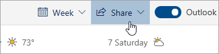

# 使用 Outlook 網頁版共用

從您的行事曆，於頁面頂端的工具列上選取 [共用] ****，然後選擇您要共用的行事曆。

    

**注意**：您無法共用其他人所擁有的行事曆。

- 輸入您要共用行事曆的人員名稱或其電子郵件地址。
- 選擇共用對象可如何使用您的行事曆：
    - **可以檢視我忙碌的時間** 允許共用對象檢視我的忙碌時間，但不包括活動位置等詳細資料。
    - **可以檢視標題和位置** 允許共用對象檢視您的忙碌時間，以及活動的標題和位置。
    - **可以檢視所有詳細資料** 允許共用對象檢視活動的所有詳細資料。
    - **可以編輯** 允許共用對象編輯您的行事曆。
    - **代理人** 允許共用對象編輯您的行事曆並與他人共用。
- 選取 [共用] ****。
