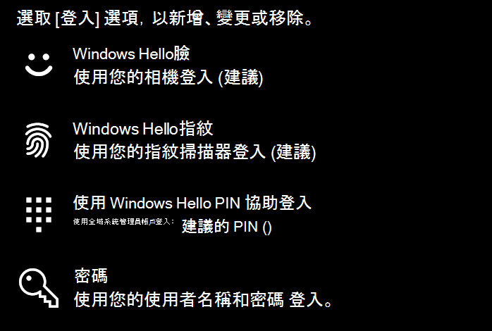

# 不使用密碼登入 Windows 10

若要避免在 Windows 啟動時輸入密碼，建議您使用其中一個 Windows Hello 安全登入選項，如 PIN、面孔識別或指紋（如果有的話）。 如果您真的想要停用安全登入，請參閱下列的「自動登入 Windows 10」指示。

**保護帳戶密碼的 Windows Hello 備選項**

移至 [ **設定] > 帳戶 > 登入選項** ] (或按一下 [ [這裡](ms-settings:signinoptions?activationSource=GetHelp)) ]。 將會列出可用的登入選項。 例如：

按一下或點擊其中一個選項加以設定。 當您下次啟動或解除鎖定 Windows 時，您就可以使用新的選項，而不是密碼。 

**自動登入至 Windows 10**

**附注**：自動登入非常方便，但會帶來安全性風險，尤其是當您的電腦可由多人存取時。 

1. 按一下或點擊工作列中的 [ **開始** ] 按鈕。

2. 輸入 **netplwiz** ，然後按 Enter 鍵，以開啟 [使用者帳戶] 視窗。

3. 在 [ **使用者帳戶**] 中，按一下 Windows 啟動時要自動登入的帳戶。

4. 取消選取 [使用者必須輸入使用者名稱和密碼才能使用此電腦] 核取方塊。

    ![使用者必須輸入 [使用者名稱] 和 [密碼] 選項。](media/users-must-enter-username.png)

5. 按一下 **[確定]**。 系統會要求您輸入並確認您所選取之帳戶的密碼。 按一下 [確定]**** 完成。 下次 Windows 10 開始時，它會自動登入您選取的帳戶。
