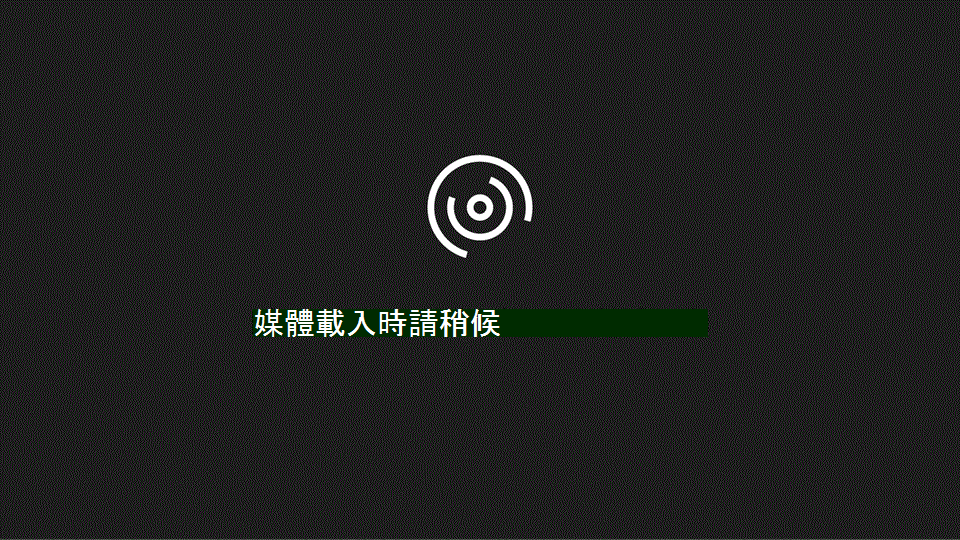

# 設定網域和使用者Set up domain and users

當您準備好設定您的網域和使用者時，請觀看這段快速影片：When you're ready to set up your domain and users, watch this quick video:
  

  
如需詳細資訊，請參閱[網域的常見問題集。](https://support.office.com/article/1272bad0-4bd4-4796-8005-67d6fb3afc5a.aspx)For more information, see the [Domains FAQ.](https://support.office.com/article/1272bad0-4bd4-4796-8005-67d6fb3afc5a.aspx)
  

