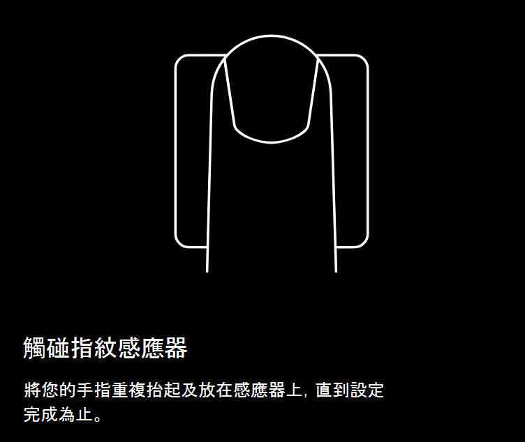
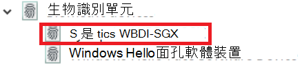

# 使用 Windows 10 中的指紋解除鎖定選項Use fingerprint unlock option in Windows 10

**啟用 Windows Hello 指紋****Enable Windows Hello Fingerprint**

若要使用您的指紋解除 Windows 10 的鎖定，您需要透過新增 (讓 Windows 瞭解至少有一個手指可辨識) ，以設定 Windows Hello 指紋。To unlock Windows 10 using your fingerprint, you need to set up Windows Hello Fingerprint by adding (letting Windows learn to recognize) at least one finger. 

1. 移至 [ **設定] > 帳戶 > 登入選項** ] (或按一下 [ [這裡](ms-settings:signinoptions?activationSource=GetHelp)) ]。Go to **Settings  > Accounts > Sign-in options** (or click [here](ms-settings:signinoptions?activationSource=GetHelp)). 將會列出可用的登入選項。Available sign-in options will be listed. 例如：For example:

    

2. 按一下或點擊 [ **Windows Hello 指紋**]，然後按一下 [ **設定**]。Click or tap **Windows Hello Fingerprint**, then click **Set up**. 按一下 [Windows Hello 安裝程式] 視窗中的 [ **開始**]。In the Windows Hello setup window, click **Get started**. 指紋感應器將啟動，系統會要求您將手指置於感應器上：The fingerprint sensor will activate, and you'll be asked to place your finger on the sensor:

   

3. 遵循指示，它會要求您重複掃描手指。Follow the instructions, which will ask you to repeatedly scan your finger. 完成此作業後，您可以選擇新增您可能想要用於登入的其他手指。When this is finished, you'll have the option of adding other fingers you may want to use for sign-in. 當您下次登入 Windows 10 時，您可以選擇使用您的指紋來執行此動作。Next time you sign in to Windows 10, you will have the option of using your fingerprint to do so.

**Windows Hello 指紋無法當作登入選項使用****Windows Hello Fingerprint not available as a sign-in option**

如果 Windows Hello 指紋未顯示為 [登入] **選項**中的選項，表示 windows 不會察覺電腦上連接的任何指紋辨識器/掃描器，或者如果您的電腦是由您的工作地點) 所管理，則系統原則可以避免其使用 (。If Windows Hello Fingerprint is not shown as an option in **Sign-in options**, it means Windows is not aware of any fingerprint reader/scanner attached to your PC, or that a system policy prevents its use (if for example your PC is managed by your workplace). 若要疑難排解：To troubleshoot: 

1. 選取工作列中的 [ **開始** ] 按鈕，然後搜尋 [ **裝置管理員**]。Select the **Start** button in the Taskbar and search for **Device Manager**.

2. 按一下或點擊以開啟 [ **裝置管理員**]。Click or tap to open **Device Manager**.

3. 在 [裝置管理員] 中，按一下 [生物] 裝置的燕尾展開。In Device Manager, expand Biometric devices by clicking its chevron.

   

4. 您的指紋掃描器應列為生物識別單元，例如 Synaptics WBDI 掃描程式：Your fingerprint scanner should be listed as a biometric device, such as the Synaptics WBDI scanner:

   

5. 如果您的指紋掃描器未顯示，且掃描器已整合到您的電腦，請移至電腦製造商的網站。If your fingerprint scanner is not shown, and the scanner is integrated into your PC, go to the PC manufacturer's website. 在您的電腦型號的技術支援區段中，搜尋您可以安裝之掃描器的 Windows 10 驅動程式。In the technical support section for your PC model, search for a Windows 10 driver for a scanner that you can install.

6. 如果掃描器與 PC 不同于透過 USB) 相連 (，請移至掃描器製造商的網站，針對您所擁有的掃描器模型，尋找並安裝 Windows 10 裝置驅動程式軟體。If the scanner is separate from the PC (attached via USB), go to the scanner manufacturer's website to find and install Windows 10 device driver software for the scanner model you have.
