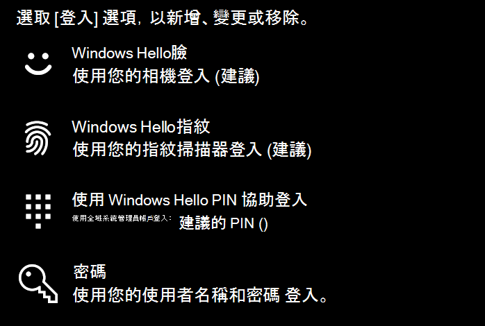

# 使用 Windows 10 中的指紋解除鎖定選項

**啟用 Windows Hello 指紋**

若要使用您的指紋解除 Windows 10 的鎖定，您需要在至少一個手指上新增（讓 Windows 瞭解可辨識）以設定 Windows Hello 指紋。 

1. 移至 [**設定] > 帳戶] > 登入選項**（或按一下[這裡](ms-settings:signinoptions?activationSource=GetHelp)）。 將會列出可用的登入選項。 例如：

    

2. 按一下或點擊 [ **Windows Hello 指紋**]，然後按一下 [**設定**]。 按一下 [Windows Hello 安裝程式] 視窗中的 [**開始**]。 指紋感應器將啟動，系統會要求您將手指置於感應器上：

   

3. 遵循指示，它會要求您重複掃描手指。 完成此作業後，您可以選擇新增您可能想要用於登入的其他手指。 當您下次登入 Windows 10 時，您可以選擇使用您的指紋來執行此動作。

**Windows Hello 指紋無法當作登入選項使用**

如果 Windows Hello 指紋未顯示為登**入選項**中的選項，表示 windows 不會察覺任何連接至您電腦的指紋辨識器/掃描器，或系統原則禁止使用（如果您的電腦是由您的工作場所所管理）。 若要疑難排解： 

1. 選取工作列中的 [**開始**] 按鈕，然後搜尋 [**裝置管理員**]。

2. 按一下或點擊以開啟 [**裝置管理員**]。

3. 在 [裝置管理員] 中，按一下 [生物] 裝置的燕尾展開。

   

4. 您的指紋掃描器應列為生物識別單元，例如 Synaptics WBDI 掃描程式：

   

5. 如果您的指紋掃描器未顯示，且掃描器已整合到您的電腦，請移至電腦製造商的網站。 在您的電腦型號的技術支援區段中，搜尋您可以安裝之掃描器的 Windows 10 驅動程式。

6. 如果掃描器與電腦（透過 USB 相連）分開，請移至掃描器製造商的網站，針對您所擁有的掃描器模型，尋找並安裝 Windows 10 裝置驅動程式軟體。
