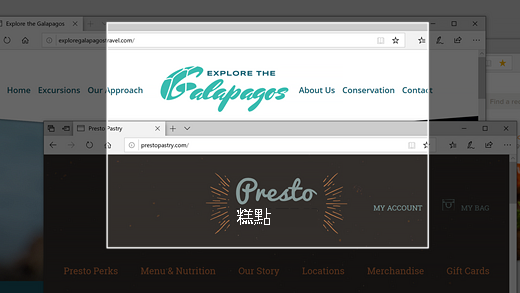
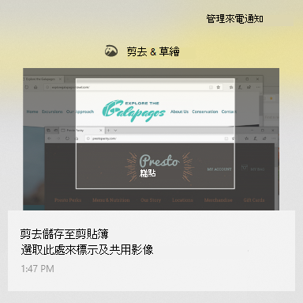

# 使用截圖 & 草繪、標示及共用影像Use Snip & Sketch to capture, mark up, and share images

螢幕草圖現在稱為 **剪剪 & 草繪**。Screen sketch is now called **Snip & Sketch**. **若要快速拍攝剪剪**：**To quickly take a snip**:

1. 按 **Windows 標誌鍵 + Shift + S**。您會看到螢幕變暗，而且游標顯示為叉線。Press the **Windows logo key + Shift + S**. You'll see your screen darken and your cursor displayed as a cross. 

2. 選擇您要複製之區域的邊上點，並以滑鼠右鍵按一下游標。Choose a point at the edge of the area you want to copy and left-click the cursor. 

3. 移動游標以反白顯示您想要捕獲的區域。Move your cursor to highlight the area you want to capture. 您所捕獲的區域會出現在螢幕上。The area you capture will appear on your screen.

   

您 snipped 的影像會儲存至您的剪貼簿，準備貼到電子郵件或檔中。The image you snipped is saved to your clipboard, ready for pasting into an email or document. 

**如果您想要編輯或查看影像**：**If you want to edit or view the image**: 

- 按一下工作列右下方的 [通知] 圖示;然後按一下您剛捕獲的圖片。Click the notifications icon at the far right side of the taskbar; then click the picture you have just captured. 您的截圖會在剪 & 草繪應用程式中開啟。Your snip opens in the Snip & Sketch app.

   
