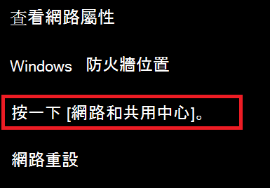
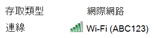

# 在 Windows 10 中查看 Wi-Fi 網路密碼

1. 請確定您的 Windows 10 電腦已連接至 Wi-Fi 網路。

2. 移至 [ **設定] > 網路 & Internet > 狀態**，或按一下或點擊 [這裡](ms-settings:network?activationSource=GetHelp) ，讓我們立即為您做。 ) 

3. 按一下 [網路和共用中心]****。

    

4. 在 [ **網路與共享中心**] 的 [連線] **旁，您**會看到您的無線網路名稱。 例如，如果您的網路命名為 "ABC123"，您可能會看到：

    

    按一下無線網路名稱，以開啟 [Wi-Fi 狀態] 視窗。 

5. 在 Wi-Fi 狀態] 視窗中，依序按一下 [ **無線屬性**]、[ **安全性** ] 索引標籤及 [ **顯示字元**]。

    

